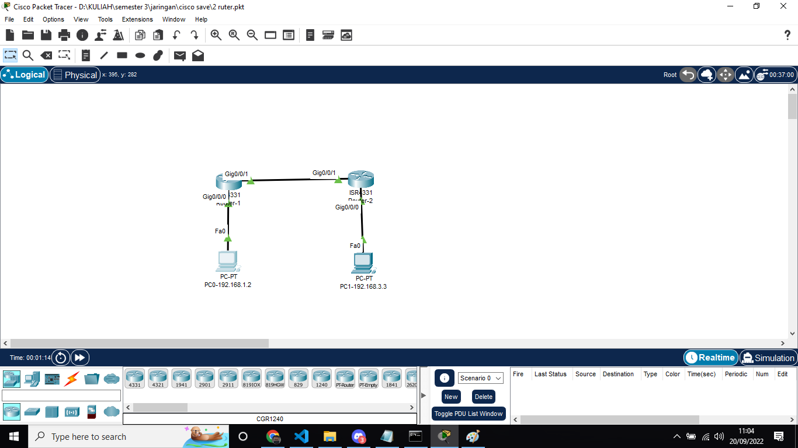
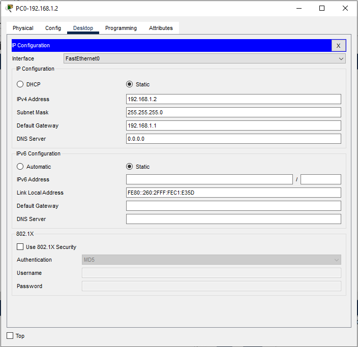
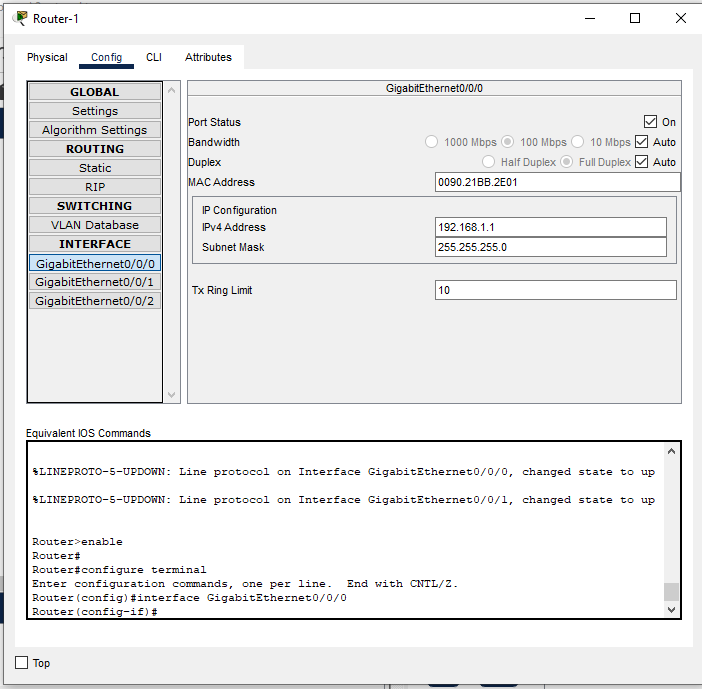
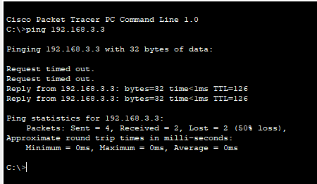
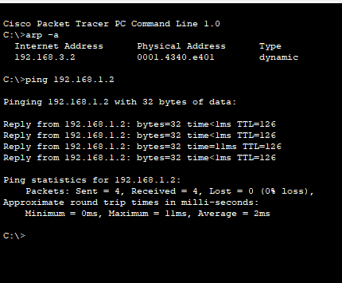

# Documentation Task Packet-Tracer
## Topologi

Topologi diatas terdiri dari 2 router dan 2 PC client dengan subneting

## Configuration IP (PC)

PC1 IP
Address -> 192.168.1.2
Subnet Mask -> 255.255.255.0 
Gateway -> 192.168.1.1

## Configuration IP (Router)

Untuk setting static routing di cisco packet tracer menggunakan perintah :
#ip route [destination] [subnet] [next hop address] Keterangan :

ip route : perintah membuat tabel routing static
destination : network jaringan yang dituju
subnet : subnet mask jaringan yang dituju
next hop address : ip dari router yang akan dilewati

## Test Ping

Terlihat gambar di atas PC2-192.168.3.3/24 tidak melakukan request ping dan hanya replay ping sebelumnya dari PC1-192.168.1.2/24 dan sudah memiliki daftar arpa cache yaitu IP 192.168.1.1 (Router 1) dengan Physical / MAC Address 0001.9724.4801 sehingga untuk melakukan ping pada PC2-192.168.3.3/24 ke PC1-192.168.1.2/24 tidak terjadi RTO lagi.