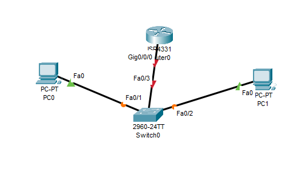
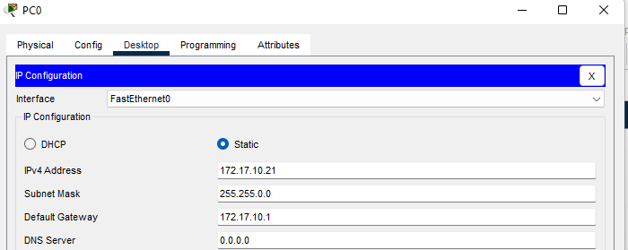
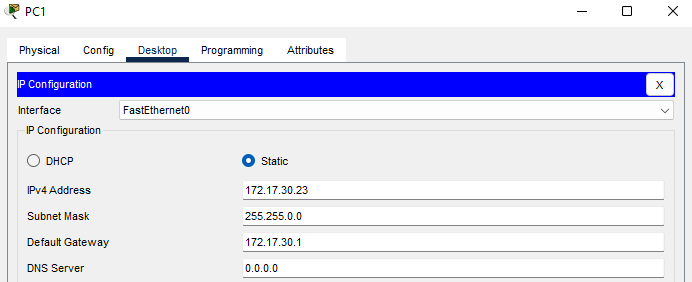
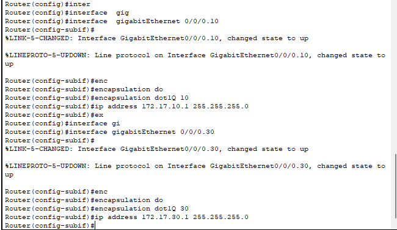
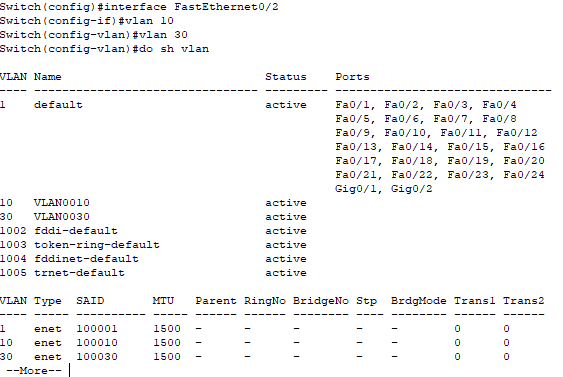
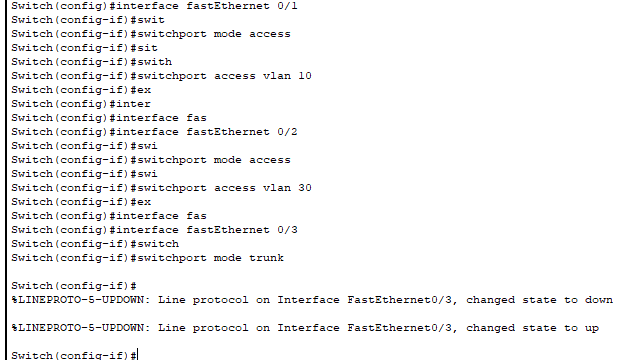
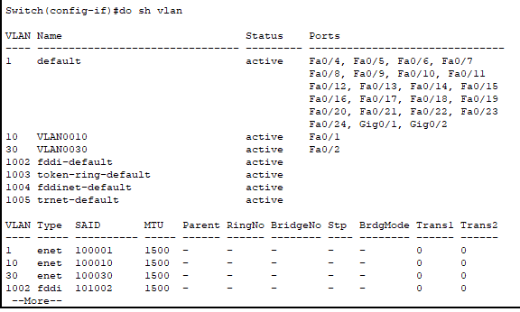
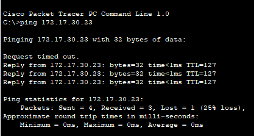

# VLAN DAN ROUTER ON STICK

## 1. Topologi Jaringan

## 2. Konfigurasi
- Konfigurasi IP PC0

- Konfigurasi IP PC1

- Konfigurasi Router On Stick pada Router

-> Sub-interface Gig0/0/0.10 untuk default gateway VLAN 10  
-> Sub interface Gig0/0/0.30 untuk default gateway VLAN 30

- Konfigurasi Vlan 10 dan Vlan 30 pada Switch

VLAN 10 dan VLAN 30 sudah ada, namun tidak memiliki PORT

- Mode access untuk interface 0/1 ke VLAN 10 dan 0/2 ke VLAN 30 pada Switch yang terhubung pada PC,
- Mode trunk untuk interface 0/3 yang terhubung dengan Router 

- Mengecek PORT VLAN 10 dan VLAN 30

-> VLAN 10 memiliki PORT 0/1  
-> VLAN 30 memiliki PORT 0/2

## 3. Ping dari PC0 ke PC1

