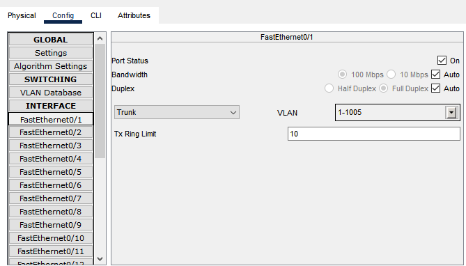

# LAPORAN PRATIKUM KONSEP JARINGAN
# Tugas lanjutan VLAN

## Topologi lanjutan VLAN
Terdapat 1 router yang terhubung dengan 1 switch kemudian switch tersebut terhubung dengan 2 switch lainnya. Setiap switch terhubung ke PC dengan 3 VLAN yang berbeda (192.168.10.0 - 10 [admin] || 172.17.20.0 - 20 [dev] || 118.18.30.0 - 30 [admin]).

## Setting VLAN di Switch, MAC, dan Router
Setting VLAN pada setiap Switch dan router pada VLAN Database seperti pada gambar dibawah ini
|Perangkat|VLAN Number|VLAN Name|
|---------|---------|---------|
|Router0  |10       |admin    |
|         |20       |developer|
|         |30       |manager  |
|Switch0  |10       |admin    |
|         |20       |developer|
|         |30       |manager  |
|Switch1  |10       |admin    |
|         |20       |developer|
|         |30       |manager  |
|Switch2  |10       |admin    |
|         |20       |developer|
|         |30       |manager  |

perlu meng setting pada router, Switch, maupun MAC untuk mendaftarkan VLAN pada setiap port yang akan dilaluinya.

- Pada router harus disett IP untuk setiap VLAN
    “Router#conf t”

    “Router(config)#int gig0/0/0.10”
    “Router(config-subif)#encapsulation dot1q 10”
    “Router(config-subif)#ip add 192.168.10.1 255.255.255.0”
    “Router(config)#int gig0/0/0.20”
    “Router(config-subif)#encapsulation dot1q 20”
    “Router(config-subif)#ip add 172.17.20.1 255.255.255.0”
    “Router(config)#int gig0/0/0.30”
    “Router(config-subif)#encapsulation dot1q 30”
    “Router(config-subif)#ip add 118.18.30.1 255.255.255.0”
- Pada Switch diset ke penghubung antar switch, pc, maupun router
  Pada setiap penghubung antar Switch dan Router mode dirubah menjadi Trunk seperti gambar dibawah ini
  

  Trunking adalah teknologi yang menyediakan akses jaringan ke beberapa klien secara bersamaan dengan berbagi satu set sirkuit, saluran, atau frekuensi.

  Dan pada ke PC mode dirubah ke Access seperti gambar dibawah
  

- Setting semua MAC yang terhubung pada VLAN
  |Perangkat|IP MAC     |Gateway  |
  |---------|-----------|---------|
  |PC0      |192.168.10.1 |192.168.10.5 |
  |PC1      |192.168.20.1  |192.168.20.5  |
  |PC2      |192.168.30.1  |192.168.30.5 |
  |PC3      |192.168.10.2 |192.168.10.5 |
  |PC4      |192.168.20.2  |192.168.20.5  |
  |PC5      |192.168.30.2  |192.168.30.5  |
  |PC6      |192.168.10.3 |192.168.10.5 |
  |PC7      |192.168.20.3  |192.168.20.5  |

## Test antar Switch dengan VLAN yang sama
1. Test VLAN 10
   
2. Test VLAN 20
   
3. Test VLAN 30
   
4. Test gagal
   
