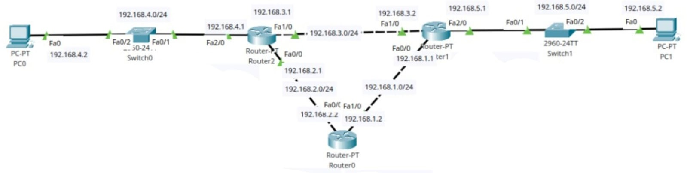
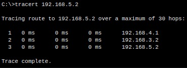
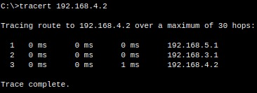
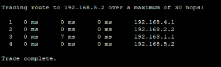
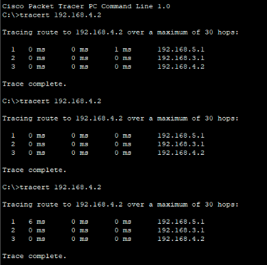

# Traceroute And Time To Live

## Traceroute

Traceroute adalah perintah yang menunjukkan jalur paket ke tujuannya. Hal ini dilakukan dengan mengirimkan pesan Internet Control Protocol Echo Request ke tujuan dengan nilai TTL yang meningkat. Dalam sistem operasi Windows, jejak ini disebut tracert.

Pembacaan trek biasanya mengembalikan tiga kolom waktu hop terpisah karena setiap trek mengirimkan tiga informasi terpisah ke setiap komputer. Di bagian atas daftar, pelacakan akan membatasi jumlah jeda baris yang akan ditampilkan. Biasanya jumlah maksimum adalah sekitar 30 hop.

Jika Traceroute tidak dapat menjangkau komputer Anda, Anda akan melihat pesan "Waktu permintaan habis". Tanda bintang muncul di tempat milidetik di setiap kolom hop.

## Time To Live

Seumur hidup atau hop adalah mekanisme untuk membatasi usia atau masa hidup data pada komputer atau jaringan. Nilai TTL menentukan bahwa paket harus diteruskan ke router hop berikutnya atau dijatuhkan. Nilai TTL default adalah 64, max adalah 255 (8 bit), setiap paket melewati router (layer 3), nilai akan dikurangi 1 sebelum memutuskan untuk meneruskan, jika TTL, router tidak akan meneruskan lalu lintas ke rute berikutnya, mendapat 1

## Topologi

Jika Traceroute tidak dapat menjangkau komputer Anda, Anda akan melihat pesan "Waktu permintaan habis". Tanda bintang muncul di tempat milidetik di setiap kolom hop.

## Konfigurasi IP PC

| Device | Interface | IP          |
| ------ | --------- | ----------- |
| PC0    | Fa0/0     | 192.168.4.2 |
| PC1    | Fa0/0     | 192.168.5.2 |

## Konfigurasi IP Router

| Device   | Interface | IP          |
| -------- | --------- | ----------- |
| Route 0  | Fa0/0     | 192.168.2.2 |
|          | Fa0/1     | 192.168.1.2 |
| Router 1 | Fa0/0     | 192.168.1.1 |
|          | Fa0/1     | 192.168.3.2 |
|          | Fa0/2     | 192.168.4.1 |
| Router 2 | Fa0/0     | 192.168.2.1 |
|          | Fa0/1     | 192.168.3.1 |
|          | Fa0/2     | 192.168.5.1 |

## Konfigurasi Static Routing pada Router

| Device   | Destination Network | Netmask       | Via         | Metric       |
| -------- | ------------------- | ------------- | ----------- | ------------ |
| Router 0 | 192.168.4.0         | 255.255.255.0 | 192.168.2.1 | 10 (Default) |
|          | 192.168.5.0         | 255.255.255.0 | 192.168.1.1 | 10 (Default) |
| Router 1 | 192.168.4.0         | 255.255.255.0 | 192.168.3.1 | 10 (Default) |
|          | 192.168.2.0         | 255.255.255.0 | 192.168.1.2 | 10 (Default) |
| Router 2 | 192.168.5.0         | 255.255.255.0 | 192.168.3.1 | 10 (Default) |
|          | 192.168.1.0         | 255.255.255.0 | 192.168.2.2 | 10 (Default) |

Topologi di atas meliputi 3 router, 2 PC dan 2 switch. Jenis router yang digunakan adalah Router-PT yang melakukan modifikasi port sesuai kebutuhan.

## Percobaan Traceroute / Tracert

Perintah untuk mengeksekusi traceroute atau tracert adalah sebagai berikut.

Pada gambar di atas, pc0 (192.168.4.2) melewati router 2 (192.168.4.1) ke pc1 (192.168.5.2), lalu ke router 1 (192.168.3.2) dan akhirnya ke pc1 (192.168.5.2) Anda dapat melihatnya itu dilacak. ).

Demikian pula, pc1 (192.168.5.2) mencapai pc0 (192.168.4.2) melalui router 1 (192.168.5.1), kemudian router 2 (192.168.3.1), dan akhirnya pc0 (192.168. 4.2).

kamu dapat melihat bahwa jalur yang diambil oleh paket data serupa tetapi tidak sama. Memang setiap router memiliki routing yang berbeda-beda. Dalam perutean ini, router memilih jalur dengan metrik terendah. Namun, kali ini metrik yang digunakan untuk semua perutean adalah metrik default 10. Membuat pemilihan jalur menjadi kurang sensitif terhadap metrik.

## Mengubah Metric Static Routing

| Device   | Destination Network | Netmask       | Via         | Metric       |
| -------- | ------------------- | ------------- | ----------- | ------------ |
| Router 0 | 192.168.4.0         | 255.255.255.0 | 192.168.2.1 | 10 (Default) |
|          | 192.168.5.0         | 255.255.255.0 | 192.168.1.1 | 10 (Default) |
| Router 1 | 192.168.4.0         | 255.255.255.0 | 192.168.3.1 | 10 (Default) |
|          | 192.168.2.0         | 255.255.255.0 | 192.168.1.2 | 10 (Default) |
|          | 192.168.4.0         | 255.255.255.0 | 192.168.1.2 | 1            |
| Router 2 | 192.168.5.0         | 255.255.255.0 | 192.168.3.1 | 10 (Default) |
|          | 192.168.1.0         | 255.255.255.0 | 192.168.2.2 | 10 (Default) |
|          | 192.168.5.0         | 255.255.255.0 | 192.168.2.2 | 1            |

Anda dapat mengubah jalur yang paling efisien dengan memodifikasi nilai metrik dalam konfigurasi perutean statis. Dalam pengujian ini, rute melalui Router 1 adalah yang paling efisien.

Pada gambar di atas, kita dapat melihat bahwa pc0 (192.168.4.2) mengikuti pc1 (192.168.5.2) setelah menambahkan router statis baru dengan metrik 1. Jalur yang diambil oleh paket data melalui set route 2 (192.168.4.1 ) ke router 0 (192.168.2.2) dan terakhir ke pc1 (192.168.5.2).

Demikian pula, pc1 (192.168.5.2) diteruskan ke pc0 (192.168.4.2). Jalur yang ditempuh paket data adalah melalui Router 1 (102.168.5.1) ke Router 0 (192.168.1.2) dan terakhir ke pc0 (192.168.4.2).

Dapat dilihat bahwa jalur yang diambil oleh paket data berbeda dari sebelumnya. Hal ini dikarenakan setiap router memiliki routing yang berbeda-beda. Dalam perutean ini router memilih jalur dengan metrik terendah. Oleh karena itu, pemilihan jalur dipengaruhi oleh metrik. Pada percobaan ini jalur yang melalui Router 1 merupakan jalur yang paling efisien. Ini karena perutean melalui router 0 memiliki metrik 1 dan perutean melalui router 1 dan 2 memiliki metrik 10.
