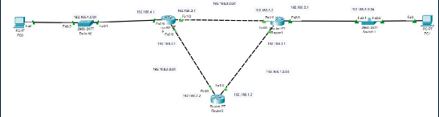
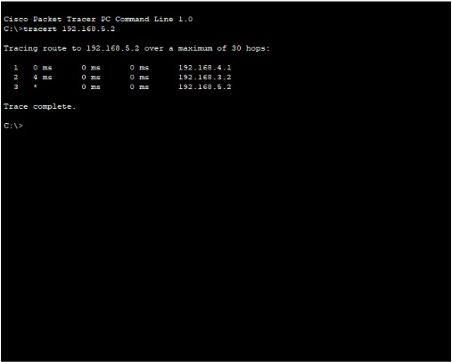

# Dynamic Routing With Protcol RIP

## Dynamic Routing

Perutean dinamis adalah metode perutean yang memungkinkan router menemukan jalan mereka ke jaringan tanpa konfigurasi manual. Perutean dinamis menggunakan protokol perutean untuk menentukan jalur ke jaringan. Protokol routing yang digunakan dalam pengujian ini adalah RIP (Routing Information Protocol).
Beginilah cara kerja perutean dinamis:

1. Router mengirimkan routing table ke semua router yang terhubung pada jaringan.
2. Router yang menerima routing table akan melakukan update routing table sesuai dengan routing table yang diterima.
3. Setelah update routing table, router akan mengirimkan routing table yang sudah diupdate ke semua router yang terhubung pada jaringan.
4. Langkah 2 dan 3 akan terus berulang sampai semua router pada jaringan memiliki routing table yang sama.

## Routing Information Protocol (RIP)

RIP adalah protokol routing yang digunakan untuk melakukan routing pada jaringan IP. RIP menggunakan metode distance vector untuk menentukan jalur ke jaringan.

Metode distance vector ini merupakan metode routing yang menggunakan distance vector untuk menentukan rute menuju jaringan. Vektor jarak ini adalah jarak dari router ke jaringan. Vektor jarak ini disebut jumlah hop. Jumlah hop adalah jumlah router yang telah melewati untuk mencapai jaringan.

RIP juga menggunakan siaran untuk memperbarui tabel perutean dan membagi cakrawala untuk menghindari loop perutean. Cara kerja RIP adalah menghitung jarak antara router dan jaringan dengan menghitung jumlah router yang dilalui untuk mencapai jaringan. Semakin sedikit router yang lewat, semakin pendek jaraknya. Jarak pendek lebih baik daripada mentransfer paket jarak jauh.

## Praktek Dynamic Routing (RIP)

### Topologi



Topologi di atas masih sama dengan minggu lalu, yang membedakan adalah penggunaan dynamic routing dengan RIP.

Contoh perintah yang digunakan pada router 0 untuk mengaktifkan RIP adalah:

```sh
Router(config)#router rip
Router(config-router)#network 192.168.1.0
Router(config-router)#network 192.168.2.0
```

### Testing



Kita dapat melihat bahwa jalur yang diambil oleh paket yang dikirim dari PC0 ke PC1 adalah:

1. PC0 mengirimkan paket ke router 1.
2. Router 2 menerima paket dan mengirimkan paket ke router 1.
3. Router 2 menerima paket dan mengirimkan paket ke PC1.
4. PC1 menerima paket.

Karena tracert di atas adalah upaya pertama, Router 2 tidak memiliki tabel routing. Setelah Router 2 menerima tabel perutean Router 1, ia memperbarui tabel peruteannya. Ada penundaan waktu karena tabel perutean belum diperbarui.
