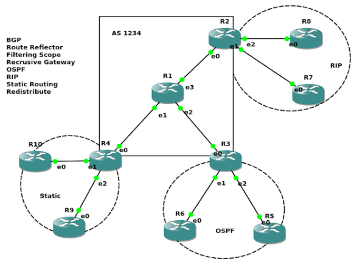
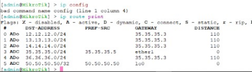
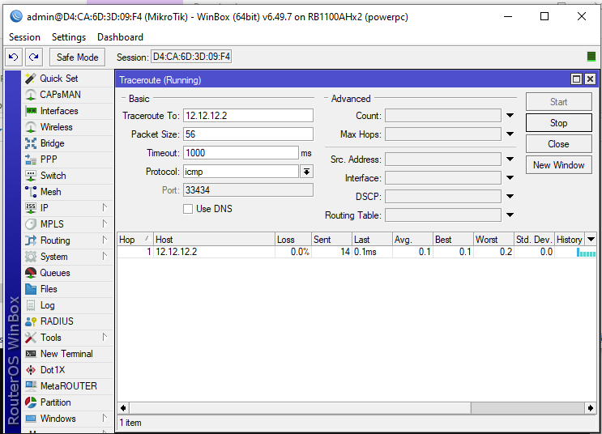
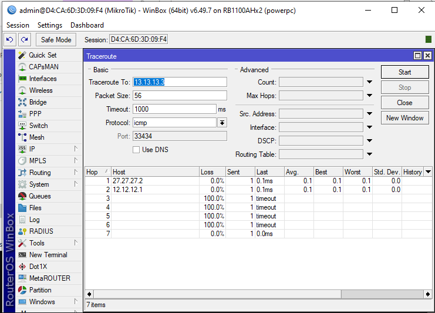
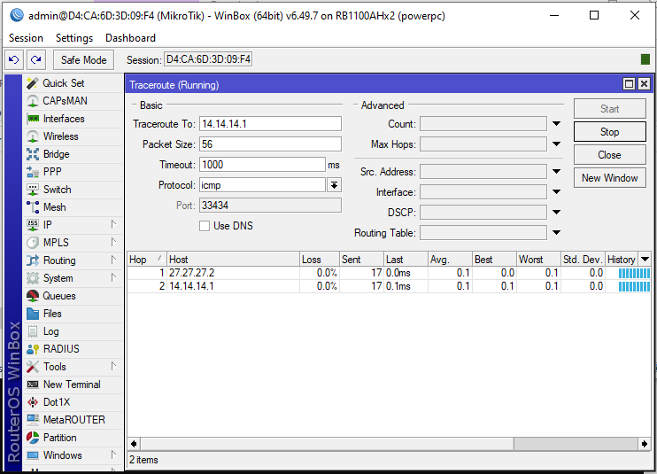
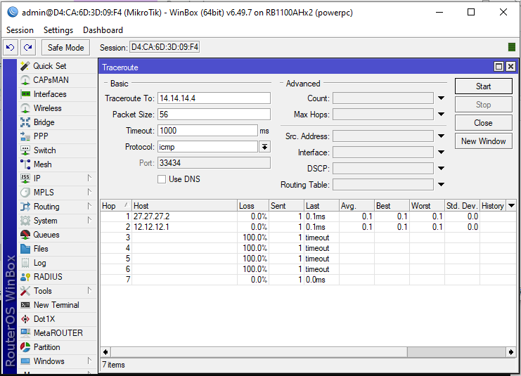
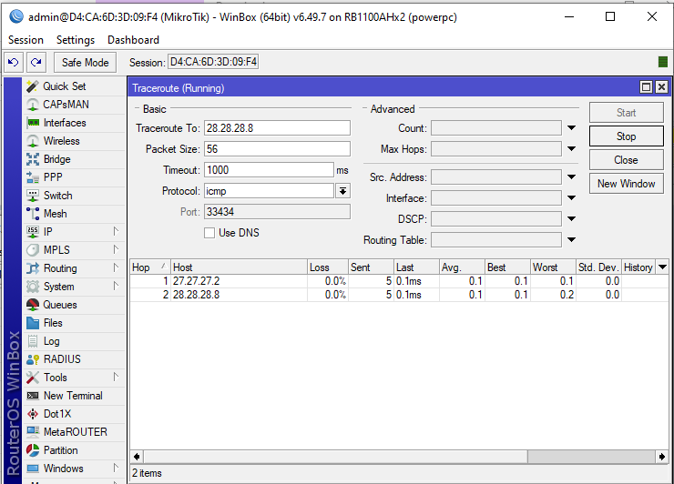

## A. Topologi

Topologi di atas terdiri dari 10 Router. R1 sebagai router utama yang akan terhubung ke AS Number yang lain. Area R2 menggunakan routing protocol RIP, area R3 menggunakan OSPF, area R4 menggunakan Static Routing, sementara untuk menghubungkan area R2, R3, dan R4 menggunakan routing protocol BGP yang terhubung ke router pusat yakni R1.

| Devices |   IP Address    | CIDR |     Network     | Interface |
| :-----: | :-------------: | :--: | :-------------: | :-------: |
|   R1    |   14.14.14.1    |  24  |   14.14.14.0    |  ether2   |
|         |   13.13.13.1    |  24  |   13.13.13.0    |  ether3   |
|         |   12.12.12.1    |  24  |   12.12.12.0    |  ether4   |
|   R2    |   12.12.12.2    |  24  |   12.12.12.0    |  ether1   |
|         |   27.27.27.2    |  24  |   27.27.27.0    |  ether2   |
|         |   28.28.28.2    |  24  |   28.28.28.0    |  ether3   |
|   R3    |   13.13.13.3    |  24  |   13.13.13.0    |  ether1   |
|         |   36.36.36.3    |  24  |   36.36.36.0    |  ether2   |
|         |   35.35.35.3    |  24  |   35.35.35.0    |  ether3   |
|   R4    |   14.14.14.4    |  24  |   14.14.14.0    |  ether1   |
|         |   41.41.41.4    |  24  |   41.41.41.0    |  ether2   |
|         |   49.49.49.4    |  24  |   49.49.49.0    |  ether3   |
|   R5    |   35.35.35.5    |  24  |   35.35.35.0    |  ether1   |
|         |   50.50.50.50   |  -   |   50.50.50.50   |    lo0    |
|   R6    |   36.36.36.6    |  24  |   36.36.36.0    |  ether1   |
|         |   60.60.60.60   |  -   |   60.60.60.60   |    lo0    |
|   R7    |   27.27.27.7    |  24  |   27.27.27.0    |  ether1   |
|         |   70.70.70.70   |  -   |   70.70.70.70   |    lo0    |
|   R8    |   28.28.28.8    |  24  |   28.28.28.0    |  ether1   |
|         |   80.80.80.80   |  -   |   80.80.80.80   |    lo0    |
|   R9    |   49.49.49.9    |  24  |   49.49.49.0    |  ether1   |
|         |   90.90.90.90   |  -   |   90.90.90.90   |    lo0    |
|   R10   |   41.41.41.10   |  24  |   41.41.41.0    |  ether1   |
|         | 100.100.100.100 |  -   | 100.100.100.100 |    lo0    |

## B. Ruang Lingkup Kerja

Dalam pratikum kali ini kelompok kami terdiri dari Irawan Dwiarno Pangestu (3121600020), Muhammad Naufal Ikrom (3121600019), Muhammad Latif (3121600030) bertugas untuk mengatur router R7 yng menggunakan routing protocol RIP sesuai area yang telah ditentukan. Kami melakukan konfigurasi routing (routing ospf area) tersebut dengan perintah sebagai berikut:

    /interface bridge
    add name=lo0
    /ip address
    add address=27.27.27.7/24 interface=ether1 network=27.27.27.0
    add address=70.70.70.70 interface=lo0 network=70.70.70.70
    /routing rip network
    add network=27.27.27.0/24
    add network=70.70.70.70/32

## C. Table Routing

Terlihat dengan perintah ip route print untuk melihat isi tabel routing, bahwa router R7 sudah terhubung dengan router R8 yang menggunakan routing protocol RIP. Selain itu, router R5 juga terhubung dengan router R4 yang menggunakan routing protocol Static Routing dan terhubung dengan router R2 yang menggunakan routing protocol RIP. Karena terhubung dengan R1 yang menggunakan protocol BGP pada router R2-R4, maka router R5 juga menerima table routing yang otomatis terhubung juga dengan R1.

## D. Test Koneksi

Gambar-gambar di atas merupakan test koneksi dengan perintah ping ke IP Address yang telah ditentukan.

- Berhasil melakukan ping ke IP Address pada router R2 (12.12.12.2), R3 (13.13.13.3), R1 (14.14.14.1), R6 (28.28.28.8) yang tentu saja berhasil karena sudah memiliki routing tabel dengan tujuan ke network berikut.
- Gagal melakukan ping ke IP Address pada router R5 (35.35.35.5) d serta R9 (49.49.49.9) karena tidak memiliki routing tabel dengan tujuan ke network di atas. Sepertinya masalah karena tidak menerima routing tabel dari R2 dan R4 secara penuh, hanya menerima routing tabel sebatas dengan router R1 saja.
