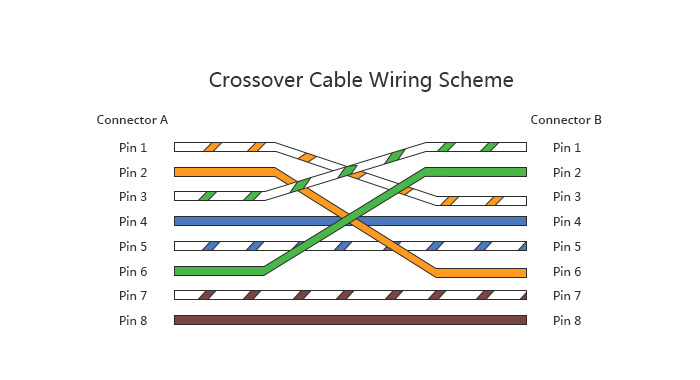

# 1. Dasar teori
Jaringan komputer (network) adalah jaringan telekomunikasi yang memungkinkan antar komputer saling berkomunikasi melalui pertukaran data. Tujuan dari setiap jaringan komputer adalah untuk mencapai tujuan itu. Setiap bagian dari jaringan komputer dapat meminta dan menyediakan layanan.

Dalam hal transaksi data dan konektivitas ke Internet, ada lapisan seperti lapisan OSI dan lapisan TCP/IP. Model OSI membagi lalu lintas jaringan menjadi beberapa lapisan. Setiap lapisan independen dari yang lain, masing-masing membangun layanan lapisan di bawahnya dan memberikan layanan kepada lapisan di atasnya. Jelaskan secara singkat tujuh lapisan model jaringan OSI.

1. Fisik (mengacu pada media fisik dimana komunikasi terjadi dapat berupa kabel LAN CAT5, sekumpulan kabel fiber optik, gelombang radio, pada dasarnya medium yang dapat digunakan untuk mengirimkan sinyal).

2. Data Link (Pada saat dua atau lebih node berbagi media fisik yang sama, contoh, beberapa komputer tersambung ke sebuah hub, atau sebuah ruangan yang penuh dengan peralatan wireless yang semua menggunakan kanal yang sama, maka mereka akan menggunakan lapisan data link untuk berkomunikasi satu sama lain. Contoh protokol data link yang sering digunakan adalah Ethernet, Token Ring, ATM, dan protokol jaringan wireless (802.11a/b/g)).

3. Jaringan (Lapisan ini adalah lapisan dimana proses routing terjadi. Paket akan meninggalkan sambungan jaringan lokal dan di kirim ulang ke jaringan lain).

4. Transport (Memberikan metoda untuk mencapai jasa tertentu di sebuah node di jaringan. Contoh protokol yang bekerja pada lapisan ini adalah TCP dan UDP).

5. Sesi (Mengatur sesi komunikasi secara logika (virtual) antara aplikasi. NetBIOS dan RPC adalah dua (2) contoh dari protokol di lapisan nomor lima).

6. Presentasi (Berurusan dengan presentasi data, sebelum data mencapai lapisan aplikasi. Pekerjaan di lapisan ini dapat berupa MIME enkoding, kompresi data, pengecekan format, pengurutan byte dsb).

7. Aplikasi (Pada lapisan ini interaksi dengan manusia dilakukan. HTTP, FTP, dan SMTP adalah contoh protokol di lapisan aplikasi).

## 1.1 Media jaringan komputer
Beberapa jenis media jaringan yang umum digunakan antara lain kabel tembaga (copper), optik (fiber), kabel nirkabel, dan kabel LAN. Namun, kabel LAN paling sering digunakan untuk menghubungkan jaringan area lokal secara bersamaan. Ada dua jenis kabel LAN: STP (Shield Twisted Pair) dan UTP (Unshield Twisted Pair).

### STP (Shield Twisted Pair)
STP sering digunakan dalam kondisi khusus. Kabel STP biasa digunakan pada peralatan elektronik seperti televisi, radio, komputer, dan telepon. Oleh karena itu, hanya untuk alasan khusus, media ini harus digunakan sebagai media transmisi. Kabel STP lebih rumit dari UTP dan relatif mahal.

### UTP (Unshield Twisted Pair)

UTP terdiri dari empat pasang kabel yang digunakan dalam jaringan yang berbeda. Masing-masing dari delapan kabel tembaga dalam kabel UTP ditutupi dengan isolasi dan kabel individu dipilin bersama. Mereka disebut tanpa pelindung karena kekebalannya yang rendah terhadap interferensi elektromagnetik.

## 1.2 Standar kabel UTP

Pemberian kategori 1/2/3/4/5/5e/6 merupakan kategori spesifikasi untuk masing-masing kabel tembaga dan juga untuk jack. Berikut penjelasan singkat kegunaan setiap kateogri kabel UTP:

- Cat 1 (Untuk koneksi suara / sambungan telepon).
- Cat 2 (Untuk protocol localtalk (Apple) dengan kecepatan data hingga 4 Mbps).
- Cat 3 (Untuk protocol ethernet dengan kecepatan data hingga 10 Mbps).
- Cat 4 (Untuk protocol 16 Mbps token ring (IBM) dengan kecepatan data hingga 20 Mbps).
- Cat 5 (Untuk protocol fast ethernet dengan kecepatan data hingga 100 Mbps).
- Cat 5e (Untuk protocol fast ethernet dengan kecepatan data hingga 250 Mbps).
- Cat 6 (Untuk protocol fast ethernet dengan kecepatan data hingga 10 Gbit/s).

## 1.3 Koneksi dengan kabel UTP\

Pemasangan urutan kabel UTP umunya mengikuti aturan standar internasional yaitu aturan IEA/TIA 568A dan TIA/EIA 568B aturan kabelnya adalah sebagai berikut.

Aturan IEA/TIA 568A Urutan ke 1 : Putih Hijau Urutan ke 2 : Hijau Urutan ke 3 : Putih Orange Urutan ke 4 : Biru Urutan ke 5 : Putih Biru Urutan ke 6 : Orange Urutan ke 7 : Putih Coklat Urutan ke 8 : Coklat

Aturan TIA/EIA 568B Urutan 1 : Putih Orange Urutan 2 : Orange Urutan 3 : Putih Hijau Urutan 4 : Biru Urutan 5 : Putih Biru Urutan 6 : Hijau Urutan 7 : Putih Coklat Urutan 8 : Coklat

### a. Straight

Jenis kabel ini menggunakan standar yang sama antara ujung satu dengan ujung yang satunya lagi. Jika pada ujung pertama susunan yang kita pakai adalah EIA/TIA 568A, maka pada ujung yang kedua kita menggunakan susunan yang sama pula yaitu EIA/TIA 568A. Begitu juga bila salah satu ujungnya menggunakan susunan EIA/TIA 568B, maka ujung satunya menggunakan susunan yang sama. Jadi sederhananya, pin 1 pada salah satu ujung akan terhubung dengan pin 1 pada ujung yang lainnya, lalu pin 2 akan terhubung dengan pin 2, dan seterusnya.

Kabel straight trought ini biasanya digunakan untuk peragkat yang tidak sejenis, semisal:

- PC dengan Switch
- PC dengan HUB
- Switch dengan Router

### b. Crossover

Susunan kabel Cross Over berbeda dengan kabel Straight Trough. Jika pada salah satu ujungnya menggunakan standar EIA/TIA 568A, maka pada ujung kedua harus menggunakan standar EIA/TIA 568B. Bersama-sama kita lihat pada gambar di bawah, kabel crossover adalah kabel yang mengirim dan menerima data, dan dua pasang kabel lainnya memiliki tata letak yang tetap.

Kabel Cross Over digunakan untuk menghubungkan perangkat yang sejenis, semisal:

- PC dengan PC
- Switch Dengan Switch
- Hub dengan Hub
- Router dengan Router

## 2. Pembuatan Kabel UTP

Dalam pembuatan kabel UTP adalah kabel yang biasa digunakan untuk menghubungkan komputer dengan komputer lain melalui peralatan jaringan. Selain itu, kabel ini juga biasa digunakan untuk menghubungkan komputer dengan perangkat jaringan lain seperti router dan switch. Kali ini saya akan berbagi trik cara membuat kabel UTP straight dan cross agar anda bisa membuat jaringan di komputer anda untuk terkoneksi secara online ke internet atau secara lokal.

### 2.1. Alat Yang Dipersiapkan Dan Kegunakannya

Alat-alat yang perlu dipersiapakan untuk pembuatan kabel UTP:
1. Tang penjepit adalah alat untuk memotong kabel UTP dan untuk mengeriting ujung konektor, dan sangat penting bagi kita yang ingin belajar cara mengkerutkan kabel, alat ini terlihat hampir seperti tangki yang umum kita lihat atau sering kita jumpai.

2. Kabel UTP kita gunakan untuk saling menghubungkan jaringan internet dan di dalam kabel UTP ini terdapat 8 helai kabel kecil yang berwarna-warni. 

3. Konektor adalah alat yang kita pasang pada ujung kabel UTP agar kabel tersebut dapat kita tancapkan ke port LAN. Konektor RJ-45 harus dipasang di ujung kabel UTP atau kabel UTP akan sia-sia.

4. Lan Tester adalah alat untuk mengecek hasil crimping kabel kita, jika crimping kita salah maka lampu cable test tidak menyala dan jika hasil crimping kita benar maka lampu cable test akan otomatis menyala, jadi alat ini sangat berguna untuk kita mengetahui hasil bending kami.

## 2.2. Langkah Pembuatan Kabel Tipe Straight

Langkah-lankah pembuatan kabel UTP tipe straight

1. Kupas bagian ujung kabel UTP, kira-kira 2 cm.

2. Buka pilinan kabel, luruskan dan urutankan kabel sesuai standar gambar.

3. Setelah urutannya sesuai standar, potong dan ratakan ujung kabel,

4. Masukan kabel yang sudah lurus dan sejajar tersebut ke dalam konektor RJ-45, dan pastikan semua kabel posisinya sudah benar sesuai dengan Straight-through.

5. Lakukan crimping dengan crimping tool, tekan crimping tool dan pastikan semua pin (tembaga) konektor RJ-45 sudah “tergigit” masing-masing kabel. biasanya "klik" terdengar. Setelah selesai di satu sisi, ulangi di sisi lain.

 ## 2.2. Langkah Pembuatan Kabel Tipe Cross

 1. Langkah-lankah pembuatan kabel UTP tipe CrossOver

2. Kupas bagian ujung kabel UTP, kira-kira 2 cm.

3. Buka pilinan kabel, luruskan dan urutankan kabel sesuai standar gambar.

4. Setelah urutannya sesuai standar, potong dan ratakan ujung kabel,

5. Masukan kabel yang sudah lurus dan sejajar tersebut ke dalam konektor RJ-45, dan pastikan semua kabel posisinya sudah benar sesuai dengan Crossover

6. Lakukan crimping dengan crimping tool, tekan crimping tool dan pastikan semua pin (tembaga) konektor RJ-45 sudah “tergigit” masing-masing kabel. biasanya "klik" terdengar. Setelah selesai di satu sisi, ulangi di sisi lain.

## 3.0. Pengetesan Kabel UTP

Langkah uji kabel yang kita lakukan sebelumnya adalah menggunakan LAN tester, caranya masukkan setiap ujung kabel (konektor RJ-45) ke setiap port yang tersedia pada LAN tester, nyalakan dan pastikan semua lampu LED menyala urutan kabel yang kami pesan.

## 3.1. Alat Pengetesan
Alat pengujian kabel UTP biasanya menggunakan Lan tester. Lan Tester adalah alat untuk menguji sambungan sambungan kabel LAN RJ 45 dan RJ 11. Dilengkapi dengan lampu indikator, tombol pengatur kecepatan, serta baterai dan kantong kecil. Dari namanya saja sudah jelas bahwa LAN tester adalah alat untuk menguji rangkaian sambungan kabel LAN RJ 45 dan RJ 11.

## 3.2. Cara Pengetesan Alat
1. Cara menguji kabel croos Fungsi kabel straight memungkinkan 2 perangkat yang berbeda untuk dihubungkan dan merupakan kabel dengan instalasi yang sama dari satu ujung ke ujung lainnya. Jika Anda menguji kabel lurus, semua LED #1-8 akan menyala secara berurutan.

- 1 -> 1
- 2 -> 2
- 3 -> 3
- 4 -> 4
- 5 -> 5
- 6 -> 6
- 7 -> 7
- 8 -> 8

2. Cara menguji kabel straight Fungsi kabel crossover memungkinkan untuk menghubungkan dua perangkat yang identik, dengan susunan kabel yang berbeda dari satu ujung ke ujung lainnya. Walaupun kombinasi kabelnya berbeda, namun crossover menggunakan kabel yang sama yaitu kabel UTP. Dan jika ingin menguji kabel crossover, urutan lampunya berbeda dengan urutan lampu kabel straight.

- 1 -> 3
- 2 -> 6
- 3 -> 1
- 4 -> 4
- 5 -> 5
- 6 -> 2
- 7 -> 7
- 8 -> 8
