Sebelum melakukakn Simulasi packet dari PC0 ke PC1 saya cek di **PC0**, apakah ada tersimpan Destination MAC Adreess dalam hal ini MAC dari PC1, dengan menggunakan perintah:

```
> arp -a
```

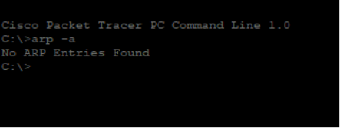

Kemudian lakukan ping ke alamat IP dari PC1.


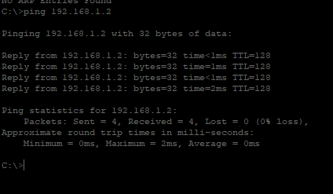

Dari situ maka terlihat di animasi packet tracer maka akan ada surat biru. 

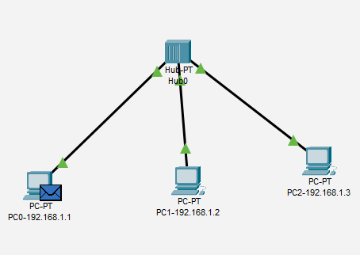

Surat biru itu merupakan packet broadcast (bukan ICMP sendiri) karena pada proses enkapsulasi icmp masih belum mendapat MAC Address destanation nya. 


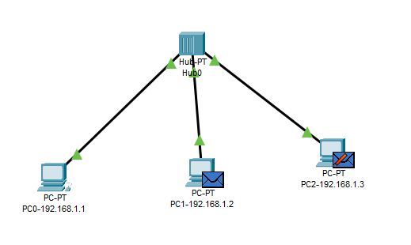

Jika selesai mendapatkan MAC address maka akan dikembalikan ke pc0 atau yang membroadcast tadi,

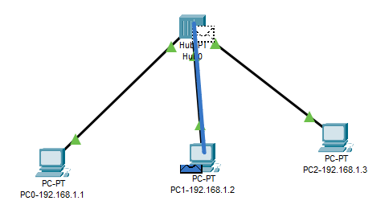

Jika di lihat PDU Information nya maka akan terlihat pada layer 2 (DataLink) akan terlihat physical address dari pc yang dituju, karena sebelumnya sudah melakukan broadcat ke jaringan yang se subnet.


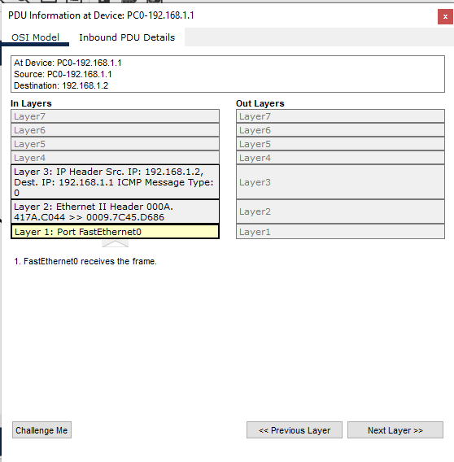

Kemudian data sudah bisa didistribusikan ke IP tujuan.

## Bagaimana kalau physical address tujuan sudah tersimpan di ARP cache ?

Ini sedikit spekulatif, di beberapa laptop teman saya, walaupun sudah tersimpan. Di laptop saya sendiri tidak perlu broadcast ulang jika sudah tersimpan.


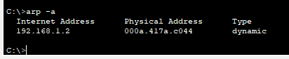

Saya mencoba ping lagi ke alamat IP dari PC1, PC0 langsung melakukakan sending data


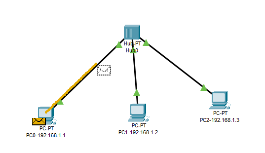

Berikut data detail status packet pada proses ping diatas


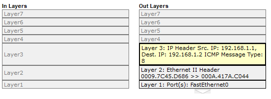

## Coba kirim data dari PC2 ke PC0

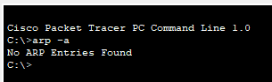

Saya mencoba untuk mengirim data dari PC2 ke PC0. Yang terjadi adalah PC2 melakukan broadcast seperti yang terjadi pada proses pertama.

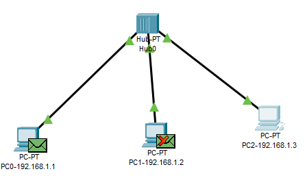

Jika sudah mendapatkan physical address destination maka data dari ICMP bisa dikirim ke tujuan


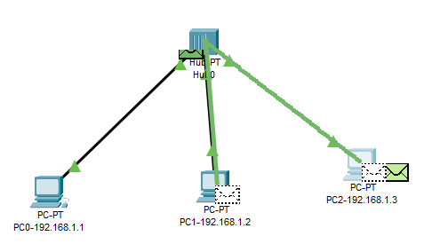


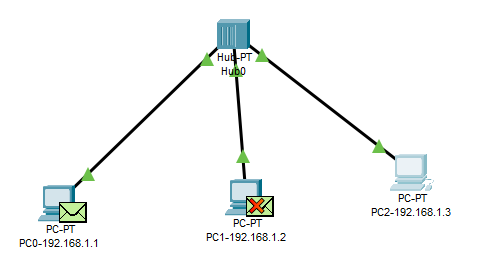


